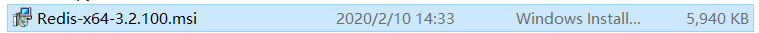
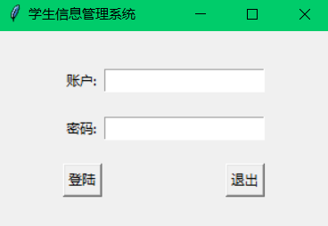
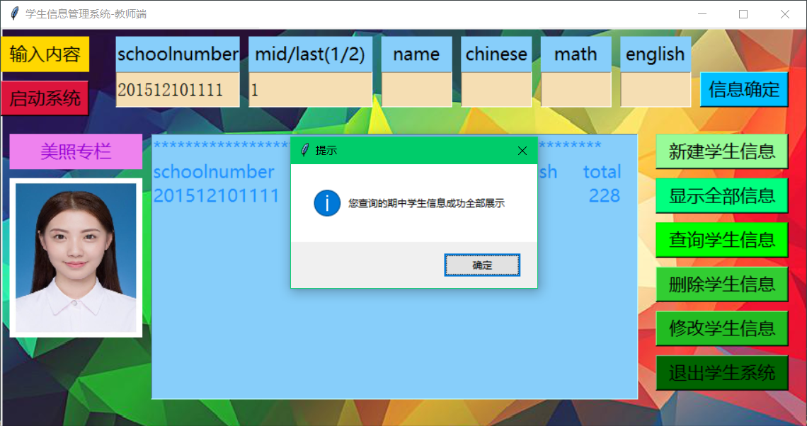
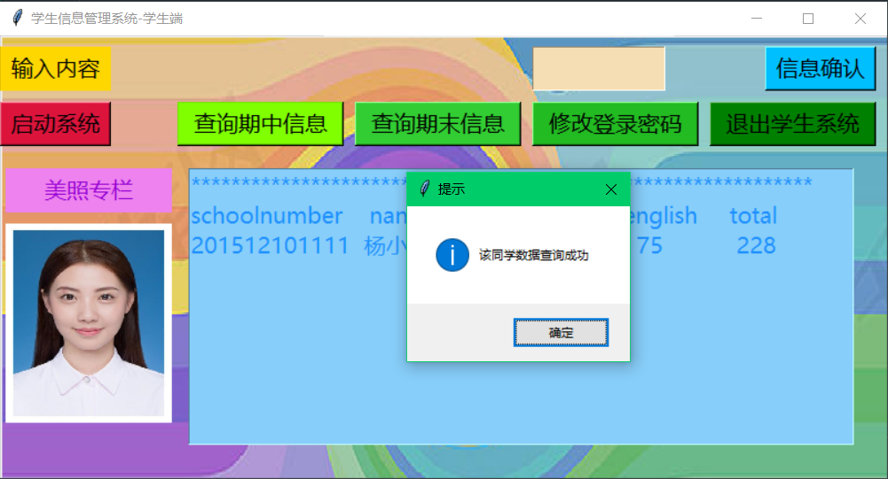
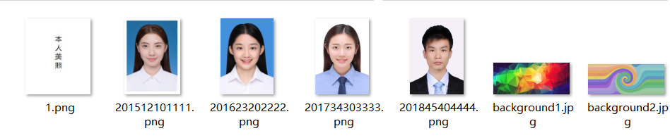
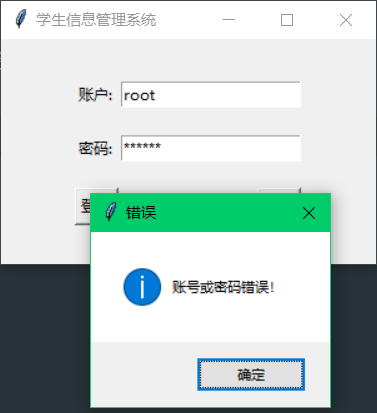

# Student-information-management-system

本项目是一个学生信息管理系统，这个项目是用Python语言实现的，也实现了图形化界面的显示，同时也实现了管理员端，学生端两个登陆入口，同时底层使用的是Redis做的数据持久化。
This project is a student information management system, this project is implemented in Python language, but also to achieve the graphical interface display, but also to achieve the administrator side, the student side of the two login entrance, at the same time the bottom using Redis to do data persistence.

----------------

### Python实现学生信息管理系统图形化界面-老师端-学生端项目

### 一，本项目简介

#### 1.1 项目的功能介绍：

本项目是一个有关学生信息管理系统的项目，项目实现语言：Python。相关的功能：

- 常见的学生信息的增删改查操作。
- 当查询单个学生的信息时可以在界面上显示学生的一寸免冠照。
- 可以区分期中，期末的成绩。
- 后台使用的是Redis数据库
- 实现了教师端登陆，学生端登录双页面。
- 可以进行用户密码的修改

#### 1.2 项目涉及到的技术点：

- Python语言实现相关的逻辑
- tkinter页面设计，图片处理等相关的Python库
- Python对接Redis数据库实现数据的相关操作

### 二，项目结构，环境及展示

#### 2.1 项目结构

- 当前项目
  - img（存储相关图片资源的目录）
  - InitData.py（为数据库初始化学生数据使用，用于做实验）
  - Main.py（运行项目的入口文件）
  - LoginPage.py（实现老师，学生登录的功能实现文件）
  - StudentManager.py（老师端功能实现页面）
  - StudentOnly.py（学生端功能实现页面）

#### 2.2 项目环境

##### 2.2.1 Python环境

我使用的是 Anaconda 的本地继承环境，内置 Python3.6.5的版本

```powershell
C:\Users\云梦归遥>python -V
Python 3.6.5 :: Anaconda, Inc.
```

##### 2.2.2 相关的Python库

- tkinter
- redis
- json
- pillow

##### 2.2.3 数据持久化实现-Redis数据库



- 官网下载，傻瓜式安装即可

- 如果有需要还可以下载一个Redis的可视化工具，就是你可以切实的，直观的看到和管理数据库，以及相关的数据的一个图形化界面工具

#### 2.3 项目展示

##### 2.3.1 登录页面



##### 2.3.2 老师（管理员）页面



##### 2.3.3 学生端页面




### 三，项目各个部分细节

#### 3.1 首先是 InitDada.py，

##### 这个文件为我们做简单的实验演示提供了一些初始化的数据，当运行此文件就会对接到Redis数据库，然后我们就可以真正的运行我们的项目了

```python
import redis
import json

db2 = redis.Redis(host='127.0.0.1', port=6379, db=3, decode_responses=True)
db1 = redis.Redis(host='127.0.0.1', port=6379, db=2, decode_responses=True)
db0 = redis.Redis(host='127.0.0.1', port=6379, db=1, decode_responses=True)
db2.hset('student', '201512101111', json.dumps(
    {'schoolnumber': '201512101111', 'name': '杨小颖', 'chinese': 89,
     'math': 84, 'english': 85, 'total': 258}))
db0.hset('student', '201512101111', json.dumps(
    {'schoolnumber': '201512101111', 'name': '杨小颖', 'chinese': 79,
     'math': 74, 'english': 75, 'total': 228}))
db1.set('201512101111', '123456')
db2.hset('student', '201623202222', json.dumps(
    {'schoolnumber': '201623202222', 'name': '刘小菲', 'chinese': 75,
     'math': 70, 'english': 96, 'total': 241}))
db0.hset('student', '201623202222', json.dumps(
    {'schoolnumber': '201623202222', 'name': '刘小菲', 'chinese': 65,
     'math': 60, 'english': 86, 'total': 211}))
db1.set('201623202222', '123456')
db2.hset('student', '201734303333', json.dumps(
    {'schoolnumber': '201734303333', 'name': '关小彤', 'chinese': 100,
     'math': 100, 'english': 100, 'total': 300}))
db0.hset('student', '201734303333', json.dumps(
    {'schoolnumber': '201734303333', 'name': '关小彤', 'chinese': 90,
     'math': 90, 'english': 90, 'total': 270}))
db1.set('201734303333', '123456')
db2.hset('student', '201845404444', json.dumps(
    {'schoolnumber': '201845404444', 'name': '华小宇', 'chinese': 60,
     'math': 60, 'english': 60, 'total': 180}))
db0.hset('student', '201845404444', json.dumps(
    {'schoolnumber': '201845404444', 'name': '华小宇', 'chinese': 50,
     'math': 50, 'english': 50, 'total': 150}))
db1.set('201845404444', '123456')
```

##### 这样我们的项目就会既初始化了学生的个人信息，也初始化了用户名，密码等内容，这样就可以正常的进行登陆，以及查询，修改学生信息了。

#### 3.2 准备相关的素材图片，为我们展示学生的个人一寸免冠照提供准备




#### 3.3 接下来就可以愉快的运行我们的完整项目了

#### 3.3.1 Main.py（项目入口文件）

```python
import tkinter as tk
from LoginPage import LoginPage

root = tk.Tk()
root.title('学生信息管理系统')
LoginPage(root)
root.mainloop()
```

**这个文件主要是作为一个引用文件，起到一个引用登录页面的功能，这样直接暴露在外部的细节就会更少，也看起来更加的简洁，美观**


#### 3.3.2 LoginPage.py（实际的登录页面）

```python
import tkinter as tk
import tkinter.messagebox
from StudentManager import StudentManager
from StudentOnly import Studentonly
import redis
import json

class LoginPage(object):
    def __init__(self, master=None):
        self.root = master
        self.root.geometry('%dx%d+%d+%d' % (300, 180, 600, 200))
        self.username = tk.StringVar()
        self.password = tk.StringVar()
        self.page = tk.Frame(self.root)
        self.page.pack()
        self.create_page()

    def create_page(self):
        tk.Label(self.page).grid(row=0, stick=tk.W)
        tk.Label(self.page, text='账户: ').grid(row=1, stick=tk.W, pady=10)
        tk.Entry(self.page, textvariable=self.username).grid(row=1, column=1, stick=tk.E)
        tk.Label(self.page, text='密码: ').grid(row=2, stick=tk.W, pady=10)
        tk.Entry(self.page, textvariable=self.password, show='*').grid(row=2, column=1, stick=tk.E)
        tk.Button(self.page, text='登陆', command=self.login_check).grid(row=3, stick=tk.W, pady=10)
        tk.Button(self.page, text='退出', command=self.page.quit).grid(row=3, column=1, stick=tk.E)

    def login_check(self):
        name = self.username.get()
        secret = self.password.get()
        db2 = redis.Redis(host='127.0.0.1', port=6379, db=2, decode_responses=True)
        if name == 'root' and secret == '123456':
            self.page.destroy()
            StudentManager(self.root)
        elif name in db2.keys():
            mi = db2.get(name)
            for key in db2.keys():
                if name == key and secret == mi:
                    self.page.destroy()
                    Studentonly(self.root, name)

        else:
            tkinter.messagebox.showinfo(title='错误', message='账号或密码错误！')

if __name__ == '__main__':
    root = tk.Tk()
    LoginPage(root)
    root.mainloop()

```

**这个是登录页面的逻辑实现**

- 我将老师端简单的设置用户名为root（因为使用Linux系统习惯了，你们也可以叫admin，什么的）
- 密码的话就简单的设置了一个“123456”
- 学生端的登录的话就是直接访问数据库，进行用户名和密码的校验
- 如果用户名或密码有误，就会弹出对应的提示内容



- 若果校验成功，就会依照用户名分别进入管理员端和学生端，然后进行相关的操作


#### 3.3.3 StudentManager.py 和 StudentOnly.py 这两个文件主要是分别实现管理员端的逻辑和学生端的逻辑

##### 因为代码内容实在太多，这里就不以展示了。


### 4.我已经将整个项目开源到GitHub上

- 因为作为一名程序员，学习了这么多的开源技术，当然也要**取之于开源，用之于开源。**

- **希望大家可以多多支持，当爷爷支持大家对我的项目进行不断的修正和补充，增加更多新的功能，然后继续push到GitHub上，不断地进行修正，让它成为一个更加优秀的项目**

- **GitHub项目链接：**
- https://github.com/liuyunfei1/Student-information-management-system.git


